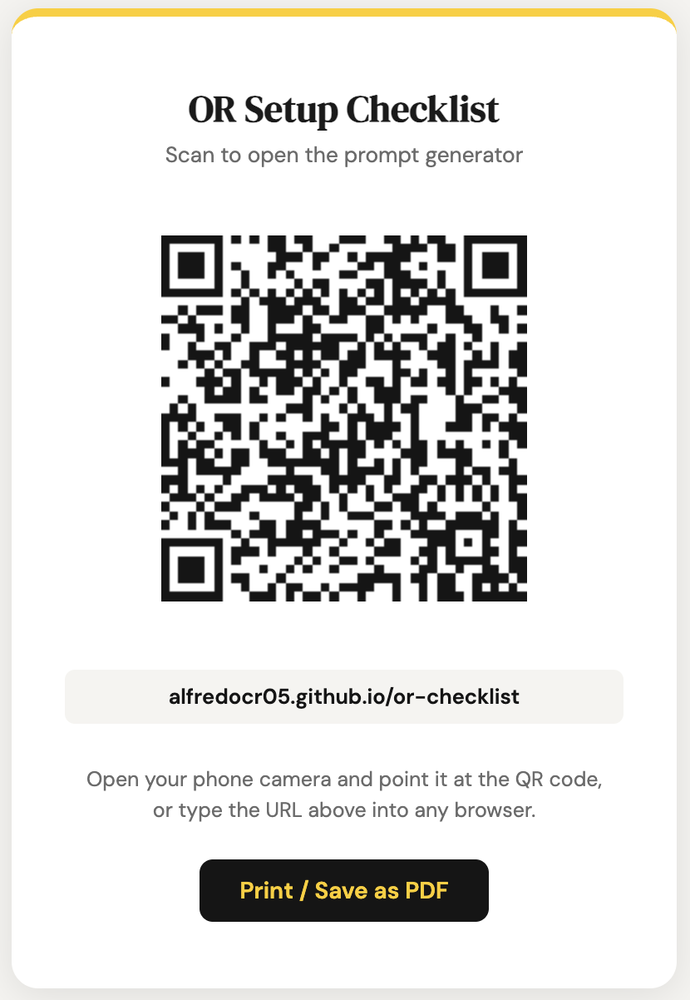

# OR Setup Checklist Prompt Generator

Browser-based tool used to standardize scenario inputs and generate structured anesthesia room setup prompts for Google Gemini.

---

## Quick Access

### Live Tool

https://alfredocr05.github.io/or-checklist/

### DOI Archive

https://doi.org/10.5281/zenodo.20673373

---

## QR Code

Scan the QR code below to open the live prompt generator directly on your phone or tablet.

Live URL:

https://alfredocr05.github.io/or-checklist/

---

## How to Use

1. Open the live prompt generator.
2. Select patient age group.
3. Select patient context.
4. Select ASA classification.
5. Select anesthesia type.
6. Enter the scheduled procedure.
7. Click **Copy Prompt**.
8. Paste the generated prompt into Google Gemini.
9. Review the generated anesthesia equipment and supply checklist.

---

## For Readers and Reviewers

The project can be accessed in three ways:

- Live web application:
  https://alfredocr05.github.io/or-checklist/

- Repository with documentation:
  https://github.com/alfredocr05/or-checklist

- Permanent DOI archive:
  https://doi.org/10.5281/zenodo.20673373

No software installation is required.
No account is required.
The tool runs directly in a web browser.
